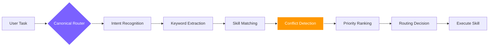

<div align="right">
  <b>🇬🇧 English</b> &nbsp;|&nbsp; <a href="./README.zh.md">🇨🇳 中文</a>
</div>

<br/>

<div align="center">

<a href="https://github.com/foryourhealth111-pixel/Vibe-Skills">
  
</a>

<br/>


<br/><br/>

### More than a skill collection — your **personal AI operating system**

If your AI supports skills, VibeSkills works. 340+ skills spanning coding, research, data science & creative work.

<br/>

<a href="https://github.com/foryourhealth111-pixel/Vibe-Skills/stargazers">
  
</a>
<a href="https://github.com/foryourhealth111-pixel/Vibe-Skills/network/members">
  
</a>
<a href="https://github.com/foryourhealth111-pixel/Vibe-Skills/pulse">
  
</a>
<a href="https://gitcgr.com/foryourhealth111-pixel/Vibe-Skills">
  
</a>

<br/><br/>


&nbsp;

&nbsp;


<br/><br/>

🧠 Planning · 🛠️ Engineering · 🤖 AI · 🔬 Research · 🎨 Creation

<br/>

<a href="https://github.com/foryourhealth111-pixel/Vibe-Skills/blob/main/docs/install/one-click-install-release-copy.en.md">
  
</a>
&nbsp;
<a href="https://github.com/foryourhealth111-pixel/Vibe-Skills/blob/main/docs/quick-start.en.md">
  
</a>
&nbsp;
<a href="./README.zh.md">
  
</a>

<br/><br/>

<kbd>Install</kbd> &nbsp;→&nbsp;
<kbd>vibe | vibe-want | vibe-how | vibe-do</kbd> &nbsp;→&nbsp;
<kbd>Smart Routing</kbd> &nbsp;→&nbsp;
<kbd>M / L / XL Execution</kbd> &nbsp;→&nbsp;
<kbd>Governance Verification</kbd> &nbsp;→&nbsp;
<kbd>✅ Delivery</kbd>

</div>

## 📋 Table of Contents

- [What makes it different](#-what-makes-it-different)
- [Who is it for](#-who-is-it-for)
- [Intelligent Routing](#-intelligent-routing-how-340-skills-collaborate-without-conflict)
- [Memory System](#-memory-system-ai-that-truly-remembers)
- [Full Capability Map](#-full-capability-map-your-all-in-one-workbench)
- [Installation & Management](#️-installation--skills-management)
- [Getting Started](#-getting-started)


<details>
<summary><b>🔑 New here? Quick glossary of key terms (click to expand)</b></summary>

<br/>

| Term | Plain-English Meaning |
|:---|:---|
| **VibeSkills / VCO** | This project. VCO = Vibe Code Orchestrator — the runtime engine behind the skills. |
| **Skill** | A focused capability module (e.g., `tdd-guide`, `code-review`). Think of skills as expert assistants the system calls on demand. |
| **Governed runtime** | When you invoke `vibe`, the system follows a structured process — clarify → plan → execute → verify — instead of diving in blindly. The public discoverable wrapper set is `vibe`, `vibe-want`, `vibe-how`, and `vibe-do`; hosts may render them as labels like `Vibe: What Do I Want?`, but they still resolve to the same canonical runtime authority. |
| **Canonical Router** | The internal logic that decides which skill to activate for your task. Just invoke `/vibe` and let it route automatically. |
| **M / L / XL grade** | Task complexity level. M = quick focused task, L = multi-step task, XL = large task with parallel work. Automatically selected. Public overrides are limited to `--l` and `--xl`; they are execution preferences, not separate entrypoints. |
| **Frozen requirement** | Once you confirm the plan, it is "frozen" — the system will not silently change scope mid-task. |
| **Root / Child lane** | In XL tasks, there is a "root" coordinator and "child" worker agents. Prevents conflicting outputs from parallel agents. |
| **Proof bundle** | Evidence that a task was actually completed correctly — test results, output, verification logs. |

</details>

> [!IMPORTANT]
> ### 🎯 Core Vision
>
> VibeSkills evolves with the times — ensuring it stays genuinely useful while **dramatically lowering the barrier to cutting-edge vibecoding technology**, eliminating the cognitive anxiety and steep learning curve that comes with new AI tools.
>
> **Whether or not you have a programming background, you can directly harness the most advanced AI capabilities with minimal effort.**
> Productivity gains from AI should be available to everyone.

<br/>

---


## ✨ What makes it different?

> Traditional skill repos answer: _"What tools do I have?"_
> **VibeSkills tackles the core pain point of heavy AI users: _"How do I manage and invoke large numbers of Skills, and get work done efficiently and reliably?"_**

<sub>Works with **Claude Code** · **Codex** · **Windsurf** · **OpenClaw** · **OpenCode** · **Cursor** and any AI environment that supports the Skills protocol. Native **MCP** compatibility.</sub>

<br/>

<div align="center">

| ❌ &nbsp;Traditional Pain Points (you've probably felt these) | ✅ &nbsp;VibeSkills Solutions (what we've built) |
|:---|:---|
| **Skills never activate**: Hundreds of capabilities in the repo, but AI rarely remembers to use them — activation rate is extremely low. | **🧠 Intelligent Routing**: The system automatically routes to the right skill based on context — no need to memorize a skill list. |
| **Blind execution**: AI dives in without clarifying requirements — fast but off-target, projects gradually become black boxes. | **🧭 Governed Workflow**: Clarify → Verify → Trace is enforced in a unified process; every step is auditable. |
| **Conflicting tools**: Lack of coordination between plugins and workflows leads to environment pollution or infinite loops. | **🧩 Global Governance**: 129 contract rules define safety boundaries and fallback mechanisms for long-term stability. |
| **Messy workspace**: After extended use, repos become cluttered; new Agents miss project details when taking over, causing handoff gaps. | **📁 Semantic Directory Governance**: Fixed-architecture file storage so any new AI conversation instantly understands the project context. |
| **AI bad habits**: Deletes main files while clearing backups; writes silent fallbacks then confidently claims "it's done". | **🛡️ Built-in Safety Rules**: Governed execution blocks dangerous bulk deletion and blind recursive wipes by default; fallback mechanisms must always show explicit warnings. |
| **Manual workflow discipline**: Users must maintain their own AI collaboration process from experience — high learning cost. | **🚦 Framework-guided end-to-end**: Requirements → Plan → Multi-agent execution → Automated test iteration — fully managed. |
| **Skill dispatch chaos in multi-agent runs**: Hard to assign the right skills to each agent for different tasks. | **🤖 Automatic Skill Dispatch**: Multi-agent workflows automatically assign the corresponding Skills to each Agent's task. |

</div>

<br/>

---


## 👥 Who is it for?

_Which of those pain points hit home? Find your position — what comes next will land harder._

<details>
<summary>Is this for you? Click to expand</summary>

<br/>

<div align="center">

| Audience | Description |
|:---:|:---|
| 🎯 **Users who need reliable delivery** | Want AI to be a dependable partner, not a runaway horse |
| ⚡ **Power users heavily relying on AI/Agents** | Need a unified foundation to support large-scale workflows |
| 🏢 **Small teams with high standardization needs** | Want AI workflows to be more maintainable and transferable |
| 😩 **Practitioners exhausted by skill sprawl** | Already tired of tool hunting — just want a ready-to-use solution |

</div>

> _If you're looking for a single small script, this may be overkill. But if you want to use AI more reliably, smoothly, and sustainably — this is your indispensable foundation._

</details>

<br/>

---


## 🔀 Intelligent Routing: How 340+ Skills Collaborate Without Conflict

_You know this is for you. Next question: 340+ skills in one system — how do they stay out of each other's way?_

With 340+ skills, you might wonder: _"Won't similar skills conflict? How does the system know which one to use?"_

### How routing works

VibeSkills uses a **Canonical Router** as the single authoritative routing decision center:



VibeSkills follows a `Clarify ➔ Plan ➔ Execute ➔ Verify` governed workflow to ensure every task goes through complete quality control:

- **Requirements Clarification**: Skills like `speckit-clarify` define clear boundaries and acceptance criteria
- **Architecture Planning**: Skills like `aios-architect` design the implementation path
- **Execution Layer**: 340+ skills called on demand to complete the actual work
- **Quality Verification**: Skills like `tdd-guide` and `code-review` ensure delivery quality

---

### Why this design?

Traditional skill repos let AI "freely choose" — the result:

- ❌ AI can't remember what skills exist
- ❌ Similar skills conflict with each other
- ❌ Execution paths are unpredictable

VibeSkills routing guarantees:

- ✅ **Determinism**: Same task always follows the same routing logic
- ✅ **Traceability**: Every routing decision has a clear rationale
- ✅ **Control**: Users can override default routing via explicit invocation (e.g. `/vibe`)
- ✅ **Stability**: 129 governance rules prevent conflicts and divergence

---

### M / L / XL Execution Levels

After selecting the primary skill, the router also automatically determines the execution level based on task complexity:

<div align="center">

| Level | Use Case | Characteristics |
|:---:|:---|:---|
| **M** | Narrow-scope work with clear boundaries | Single-agent, token-efficient, fast response |
| **L** | Medium complexity requiring design, planning, and review | Native serial execution by planned steps; bounded delegated units only when explicitly planned |
| **XL** | Large tasks — parallelizable, long-running, multi-agent wave execution | Wave-sequential orchestration with step-level bounded parallelism for independent units only |

</div>

> The system automatically selects the level after requirements clarification, before plan execution. Public host-visible entry wrappers ship as `vibe`, `vibe-want`, `vibe-how`, and `vibe-do`. Hosts may render them as `Vibe`, `Vibe: What Do I Want?`, `Vibe: How Do We Do It?`, and `Vibe: Do It`, but they still route into the same governed runtime.
>
> When the system calls a specialist skill internally (like `tdd-guide` or `code-review`), it is always scoped to a specific phase — they assist without taking over the overall coordination. In XL tasks with multiple agents, worker agents (child lanes) can suggest specialist help, but the coordinator (root) approves it before execution.
>
> You can also express an explicit preference:
> ```text
> Please execute this task according to the plan, launching XL-level workflow /vibe
> ```

> The only lightweight public grade overrides are `--l` and `--xl`. Aliases like `vibe-l`, `vibe-xl`, or `vibe-how-xl` are intentionally unsupported.

---

<details>
<summary><b>🔍 Routing FAQ (click to expand)</b></summary>

<br/>

**One route or multiple per task?**

Core principle: A task typically routes to one primary skill, but that skill can invoke others as sub-processes.

- **Single primary route**: The Canonical Router selects **the single best-matching primary skill**
- **Skill composition**: The primary skill can invoke others as needed during execution (e.g. `vibe` can invoke `speckit-clarify`, `aios-architect`, etc.)
- **Governed coordination**: Multi-skill collaboration is controlled by governance rules, not arbitrary combinations

<br/>

**How are conflicts between similar skills handled?**

When multiple skills appear capable of completing a task, the router avoids conflicts through:

1. **Priority rules**: Each skill has a clear priority and applicable scenario
2. **Context matching**: Analyzes task complexity, multi-phase needs, and explicit user preferences
3. **Mutual exclusion rules**: 129 rules include exclusion rules preventing conflicting combinations
4. **Graceful degradation**: When the preferred skill is unavailable, fallback by priority — no infinite loops

<br/>

**Will too many options cause token explosion?**

No. Routing doesn't dump all options into the model — it uses a smart trigger mechanism:

```
User command → AI-assisted governance extracts intent keywords → keywords trigger skill routing
```

The governance framework adds ~30k initial context overhead, but does not cause token explosion.

<br/>

**Real example: User says "Help me refactor this project"**

1. Intent recognition → Complex refactoring task
2. Keyword extraction → refactor, project, code quality
3. Skill matching → `vibe` / `autonomous-builder` / `systematic-debugging`
4. Routing decision → Choose `vibe` (refactoring needs multi-phase: clarify → plan → execute → verify)

</details>

<br/>

---


## 🧠 Memory System: AI That Truly Remembers

_Routing solves "which skill". But there's a deeper question: when the conversation ends, does AI remember you?_

Sound familiar?

<div align="center">

| ❌ Pain Point | ✅ VibeSkills Solution | Component |
|:---|:---|:---:|
| Re-explaining project context every new session | Architecture decisions & conventions auto-loaded on startup | `Serena` |
| AI hits the same bugs again; insights vanish with context | One sentence saves to Obsidian + GitHub permanently | `knowledge-steward` |
| Long tasks — AI gradually "forgets" early context | In-session semantic vector cache, instant retrieval | `ruflo` |
| Cross-project knowledge can't accumulate | Entity relationship graphs grow richer over time | `Cognee` |
| Long task interrupted — hard to hand off to new agent | Auto-folds into working + tool + evidence memory | `deepagent-memory-fold` |

</div>

<br/>

<details>
<summary><b>📐 Expand: Four-Tier Architecture, Memory Skills & Governance Rules</b></summary>

<br/>

VibeSkills builds a **four-tier memory system** — one authoritative component per memory need:

| Tier | Component | Scope | Core Purpose |
|:---:|:---:|:---:|:---|
| **L1 Session** | `state_store` | Current session | Execution progress, intermediate results, temp state — always-on "workbench" |
| **L2 Project** | `Serena` | Current project | Architecture decisions, conventions — written only after explicit user confirmation |
| **L3 Short-term Semantic** | `ruflo` | Intra-session | Vector cache for fast context retrieval within long-running tasks |
| **L4 Long-term Graph** | `Cognee` | Cross-session | Entity linking, relationship graphs, long-horizon knowledge accumulation |

> **Optional extensions**: `mem0` as a personal preference backend (opt-in); `Letta` provides memory block mapping vocabulary — neither replaces the four canonical tiers.

<br/>

**Three Dedicated Memory Skills**

| Skill | Role | Trigger |
|:---:|:---|:---|
| `knowledge-steward` | **Knowledge Keeper**: Saves insights, bug fixes, and prompts to Obsidian + GitHub permanently | "save this prompt" / "log this bug" / "save this insight" |
| `digital-brain` | **Second Brain**: Structured personal knowledge base — identity, content, network, retrospectives | Invoke directly; ideal for a personal knowledge OS |
| `deepagent-memory-fold` | **Context Fold**: Compresses large context into structured working/tool/evidence memory for seamless handoff | Triggers at context limit or manually |

<br/>

**Governance**: Single source of truth (no dual-track) · Explicit write only (`Serena` requires confirmation) · `episodic-memory` permanently disabled · `mem0` limited to personal preferences · Kill switch on every external backend

</details>

### What the workspace-shared memory upgrade changes in practice

This release adds a workspace-scoped memory broker so memory continuity works the way users expect:

- **Same workspace, different session/agent**: `codex`, `claude-code`, and other supported hosts can recall the same project memory inside one workspace.
- **Different workspace, zero bleed**: even if two workspaces point at the same backend root, memory stays isolated by workspace identity instead of leaking across repos.
- **Related memory only**: retrieval is gated by task-relevant terms after stripping generic runtime noise, so `$vibe`, `plan`, `continuity`, and similar scaffold words do not trigger false recalls by themselves.
- **Progressive disclosure instead of memory dumps**: requirement and planning stages receive a small set of capsule summaries, while execution gets a richer evidence pack only when needed.
- **Hard fail over silent downgrade**: if the workspace broker is unavailable, the runtime fails explicitly instead of silently falling back to legacy lane-local storage.

Plain-English flow:

1. The runtime stores small structured records such as decisions, handoff cards, and relations.
2. A follow-up task searches only the current workspace and scores records by relevant business terms.
3. The runtime injects only a few bounded memory capsules into the next stage.
4. Later stages can reveal more detail, but the full memory store is never dumped into the prompt.

See [workspace memory plane design](./docs/design/workspace-memory-plane.md) for the technical contract and [quantitative Codex memory simulation](./tests/runtime_neutral/test_codex_memory_user_simulation.py) for the benchmark coverage.


---


## ✦ Full Capability Map: Your All-in-One Workbench

_This section is not a full inventory of skill IDs. It is a practical map of the kinds of work VibeSkills can cover._

_If you only want to judge whether VibeSkills fits your task, the table below is the fastest way to read it._

<br/>

<div align="center">

| Work Area | What It Helps With | Representative Engines |
|:---|:---|:---|
| **💡 Requirements, Planning & Product Work** | Clarify vague ideas, write specs, and break work into executable plans and tasks | `brainstorming`, `writing-plans`, `speckit-specify` |
| **🏗️ Engineering, Architecture & Governed Execution** | Design systems, implement changes, and coordinate multi-step governed workflows | `aios-architect`, `autonomous-builder`, `vibe` |
| **🔧 Debugging, Testing & Quality Control** | Investigate failures, add tests, review code, and verify changes before completion | `systematic-debugging`, `verification-before-completion`, `code-review` |
| **📊 Data Analysis & Statistical Modeling** | Clean data, run statistical analysis, explore patterns, and explain results | `statistical-analysis`, `performing-regression-analysis`, `data-exploration-visualization` |
| **🤖 Machine Learning & AI Engineering** | Train, evaluate, explain, and iterate on model-driven workflows | `senior-ml-engineer`, `training-machine-learning-models`, `evaluating-machine-learning-models` |
| **🔬 Research, Literature & Life Sciences** | Review papers, support scientific workflows, and handle bioinformatics-heavy tasks | `literature-review`, `research-lookup`, `scanpy` |
| **📐 Scientific Computing & Mathematical Modeling** | Handle symbolic math, probabilistic modeling, simulation, and optimization | `sympy`, `pymc-bayesian-modeling`, `pymoo` |
| **🎨 Documentation, Visualization & Output** | Turn work into readable docs, charts, figures, slides, and other deliverables | `docs-write`, `plotly`, `scientific-visualization` |
| **🔌 External Integrations, Automation & Delivery** | Work with browsers, web content, external services, CI/CD, and deployment surfaces | `playwright`, `scrapling`, `aios-devops` |

</div>

<br/>

<details>
<summary><b>👉 Expand if needed: detailed categories, usage scenarios, and why similar skills coexist</b></summary>

<br/>

This section explains the full coverage in plain language.
It is meant to answer three practical questions:

1. When would this category be used?
2. Why do several similar skills exist at the same time?
3. Which entries are the representative starting points?

The names below are representative, not a full inventory dump. The point of this section is to explain roles and boundaries, not to turn the README into a warehouse list.

---

### 🧠 Requirements, Planning & Product Management

**When this gets used**: when the task is still fuzzy and the first job is to decide what problem is actually being solved before anyone starts coding.

**Why similar skills coexist**: they handle different stages of the same path. One clarifies the ask, another writes the spec, another turns that spec into a plan, and another breaks the plan into tasks.

**How you usually meet them**: early in a project, before a large change, or whenever a request is too vague to execute safely.

**Representative entries**: `brainstorming`, `speckit-clarify`, `writing-plans`, `speckit-specify`

---

### 🛠️ Software Engineering & Architecture

**When this gets used**: when the problem is clear enough to design system boundaries, make code changes, or coordinate a multi-step implementation.

**Why similar skills coexist**: some focus on architecture, some on implementation, and some on governed execution across several steps or agents. They are adjacent, but they are not doing the same job.

**How you usually meet them**: after planning is done, when a change touches several files, several layers, or several execution phases.

**Representative entries**: `aios-architect`, `architecture-patterns`, `autonomous-builder`, `vibe`

---

### 🔧 Debugging, Testing & Quality Assurance

**When this gets used**: when something is broken, risky, hard to trust, or ready for review.

**Why similar skills coexist**: debugging, testing, review, and final verification are separate actions. A quick bug-fix entrypoint is not the same thing as a disciplined debugging workflow, and neither replaces review or regression checks.

**How you usually meet them**: after a failure, before a PR, or whenever a change needs evidence instead of guesswork.

**Representative entries**: `systematic-debugging`, `error-resolver`, `verification-before-completion`, `code-review`

---

### 📊 Data Analysis & Statistical Modeling

**When this gets used**: when the main task is to understand data, clean it, test assumptions, or explain findings.

**Why similar skills coexist**: some are for cleaning and exploration, some for statistical testing, some for visualization, and some for specific data types or pipelines. They support one another, rather than duplicating one another.

**How you usually meet them**: before modeling, during experiment analysis, or anytime the question is "what does this data actually say?"

**Representative entries**: `statistical-analysis`, `performing-regression-analysis`, `detecting-data-anomalies`, `data-exploration-visualization`

---

### 🤖 Machine Learning & AI Engineering

**When this gets used**: when the task is no longer just data understanding, but model building, evaluation, iteration, and explanation.

**Why similar skills coexist**: training, evaluation, explainability, and experiment tracking are different parts of a model workflow. A model-training skill should not be expected to cover data analysis, and an explainability skill should not be expected to replace training infrastructure.

**How you usually meet them**: after data prep is done, when you need to train something, compare results, or understand why a model behaves a certain way.

**Representative entries**: `senior-ml-engineer`, `training-machine-learning-models`, `evaluating-machine-learning-models`, `explaining-machine-learning-models`

---

### 🧬 Research, Literature & Life Sciences

**When this gets used**: when the work itself is research-heavy, especially in literature review, scientific support, life sciences, or bioinformatics.

**Why similar skills coexist**: research workflows are naturally multi-step. One skill helps find papers, another structures evidence, another handles scientific analysis, and another focuses on life-science-specific toolchains.

**How you usually meet them**: when the request is about papers, experiments, scientific evidence, single-cell workflows, genomics, or drug-related analysis.

**Representative entries**: `literature-review`, `research-lookup`, `biopython`, `scanpy`

---

### 🔬 Scientific Computing & Mathematical Logic

**When this gets used**: when the hard part of the task is mathematical reasoning, symbolic work, formal modeling, simulation, or optimization.

**Why similar skills coexist**: some focus on symbolic derivation, some on probabilistic models, some on simulation, and some on optimization or formal logic. They may sit near each other, but they solve different kinds of mathematical work.

**How you usually meet them**: in research-heavy tasks, quantitative modeling, or workflows where natural-language reasoning is not precise enough.

**Representative entries**: `sympy`, `pymc-bayesian-modeling`, `pymoo`, `qiskit`

---

### 🎨 Multimedia, Visualization & Documentation

**When this gets used**: when the job is to turn work into something another person can read, present, review, or publish.

**Why similar skills coexist**: a chart generator, a documentation writer, a slide tool, and an image tool are all output layers, but they serve different formats and audiences. They belong in the same family because they are delivery surfaces, not because they are interchangeable.

**How you usually meet them**: near the end of a workflow, once results need to become reports, figures, slides, diagrams, or polished documentation.

**Representative entries**: `docs-write`, `plotly`, `scientific-visualization`, `generate-image`

---

### 🔌 External Integrations, Automation & Deployment

**When this gets used**: when the task depends on browsers, web content, design surfaces, external services, CI, or deployment.

**Why similar skills coexist**: browser interaction, content extraction, external service adapters, and deployment automation are related, but they solve different surface-level problems. `playwright` and `scrapling`, for example, both touch the web, but one is better for browser behavior and the other for fetching or extracting content efficiently.

**How you usually meet them**: when the work cannot stay inside the model alone and needs to touch the outside world.

**Representative entries**: `playwright`, `scrapling`, `mcp-integration`, `aios-devops`

---

Taken together, these categories are meant to cover different task types, different workflow stages, and different output surfaces. Similar skills usually coexist for predictable reasons: stage differences, domain specialization, host adaptation, or format-specific delivery.

</details>

<br/>

---


## 📊 Why is it powerful?

_Now for the numbers. This isn't a demo project — it's a running system._

The runtime core behind **VibeSkills** is **VCO**. This is not a single-point tool or a "code completion" script — it is a **super-capability network** that has been deeply integrated and governed:

<br/>

<div align="center">

|                              🧩 Skill Modules                               |                            🌍 Ecosystem                            |                               ⚖️ Governance Rules                                |
| :---------------------------------------------------------------------: | :---------------------------------------------------------------: | :----------------------------------------------------------------------: |
| <h2>340+</h2>Directly callable Skills<br/>covering the full chain from requirements to delivery | <h2>19+</h2>Absorbed high-value upstream<br/>open-source projects and best practices | <h2>129</h2>Policy rules and contracts<br/>ensuring stable, traceable, divergence-free execution |

</div>

<br/>

---


## ⚙️ Installation & Skills Management

You do not need to learn the whole architecture before you install VibeSkills.

### Default install path

1. Decide which app you are installing into: `codex`, `claude-code`, `cursor`, `windsurf`, `openclaw`, or `opencode`
2. If this is your first install and you have no special constraint, choose `install + full`
3. Open the main install guide:
   [Prompt-based install (recommended)](https://github.com/foryourhealth111-pixel/Vibe-Skills/blob/main/docs/install/one-click-install-release-copy.en.md)
4. Copy the prompt that matches your app and version, then paste it into that AI app
5. Finish the install, then continue with [Getting Started](#-getting-started)

### `full` or `minimal`?

- Choose `full` if you want the recommended setup and the simplest default path
- Choose `minimal` only if you deliberately want the smaller framework-only install

### When should you open the other install docs?

- If you are not sure which host path matches your app, start with the [cold-start host matrix](https://github.com/foryourhealth111-pixel/Vibe-Skills/blob/main/docs/cold-start-install-paths.en.md)
- If you want the longer step-by-step command path, use the [multi-host command reference](https://github.com/foryourhealth111-pixel/Vibe-Skills/blob/main/docs/install/recommended-full-path.en.md)
- If you need host-specific notes for OpenClaw or OpenCode, open the [OpenClaw host guide](https://github.com/foryourhealth111-pixel/Vibe-Skills/blob/main/docs/install/openclaw-path.en.md) or the [OpenCode host guide](https://github.com/foryourhealth111-pixel/Vibe-Skills/blob/main/docs/install/opencode-path.en.md)
- If you need an offline or manual copy path, open the [manual install guide](https://github.com/foryourhealth111-pixel/Vibe-Skills/blob/main/docs/install/manual-copy-install.en.md)

<details>
<summary><b>🔧 Advanced install details</b></summary>

Only read this part if you need manual configuration, troubleshooting, or advanced customization.

**If a guide asks you to edit something manually, these are the real file paths**

- Codex: `~/.codex/settings.json`
- Claude Code: `~/.claude/settings.json`
- Cursor: `~/.cursor/settings.json`
- OpenCode: `~/.config/opencode/opencode.json`
- Windsurf / OpenClaw sidecar state: `<target-root>/.vibeskills/host-settings.json`

**What stays visible after install**

- public runtime entry: `<target-root>/skills/vibe`
- internal bundled corpus: `<target-root>/skills/vibe/bundled/skills/*`
- compatibility helper files: only when a host explicitly needs them

The `.vibeskills` folders are split on purpose:

- host-sidecar: `<target-root>/.vibeskills/host-settings.json`, `host-closure.json`, `install-ledger.json`, `bin/*`
- workspace-sidecar: `<workspace-root>/.vibeskills/project.json`, `.vibeskills/docs/requirements/*`, `.vibeskills/docs/plans/*`, `.vibeskills/outputs/runtime/vibe-sessions/*`

**What has been verified after install**

| Host | Verified areas after install |
|:---|:---|
| `codex` | planning, debug, governed execution, memory continuity |
| `claude-code` | planning, debug, governed execution, memory continuity |
| `openclaw` | planning, debug, governed execution, memory continuity |
| `opencode` | planning, debug, governed execution, memory continuity |

These checks confirm that the installed runtime still controls routing, still writes its governance and cleanup records, and still preserves memory continuity. They do not mean that every host-specific invocation surface was exercised in the exact same way.

**Uninstall and custom skills**

- uninstall paths: `uninstall.ps1 -HostId <host>` and `uninstall.sh --host <host>`
- uninstall governance notes: [`docs/uninstall-governance.md`](https://github.com/foryourhealth111-pixel/Vibe-Skills/blob/main/docs/uninstall-governance.md)
- custom skill onboarding: [custom workflow & skill onboarding guide](https://github.com/foryourhealth111-pixel/Vibe-Skills/blob/main/docs/install/custom-workflow-onboarding.en.md)

</details>

## 📦 Standing on the Shoulders of Giants

_These capabilities were not built in isolation. VibeSkills draws on existing open-source projects, patterns, and tools, then adapts them into one governed runtime._

VibeSkills does not claim to replace or fully reproduce every upstream project listed below. The practical goal is narrower: reuse proven ideas where they fit, connect them through one runtime and governance layer, and make them easier to activate together in day-to-day work.

> 🙏 **Acknowledgements**
>
> This project references, adapts, or integrates ideas, workflows, or tooling from projects such as:
>
> `superpower` · `claude-scientific-skills` · `get-shit-done` · `aios-core` · `OpenSpec` · `ralph-claude-code` · `SuperClaude_Framework` · `spec-kit` · `Agent-S` · `mem0` · `scrapling` · `claude-flow` · `serena` · `everything-claude-code` · `DeepAgent` and more
>
> _We try to attribute upstream work carefully. If we missed a source or described a dependency inaccurately, please open an Issue and we will correct it._

<br/>

---


## 🚀 Getting Started

_If VibeSkills is already installed, start with one invocation._

> ⚠️ **Invocation note**: VibeSkills uses a **Skills-format runtime**. Invoke it through your host's Skills entrypoint, not as a standalone CLI program.

<br/>

<div align="center">

| Host Environment | Invocation | Example |
|:---:|:---:|:---|
| **Claude Code** | `/vibe` | `Plan this task /vibe` |
| **Codex** | `$vibe` | `Plan this task $vibe` |
| **OpenCode** | `/vibe` | `Plan this task with vibe.` |
| **OpenClaw** | Skills entry | Refer to the host docs |
| **Cursor / Windsurf** | Skills entry | Refer to each platform's Skills docs |

</div>

<br/>

- First try a small request such as planning, clarifying, or breaking down a task.
- If you want later turns to stay inside the governed workflow, append `$vibe` or `/vibe` to each message.
- If VibeSkills is not installed yet, start with [Prompt-based install (recommended)](https://github.com/foryourhealth111-pixel/Vibe-Skills/blob/main/docs/install/one-click-install-release-copy.en.md).

> MCP note: `$vibe` or `/vibe` only enters the governed runtime. It is **not MCP completion**, and it does not by itself prove that MCP is installed in the host's native MCP surface.

**Public host status**: `codex` and `claude-code` are the clearest install-and-use paths today. `cursor`, `windsurf`, `openclaw`, and `opencode` are available too, but some of those paths are still preview-oriented or host-specific.

<br/>

---

<details>
<summary><b>📚 Documentation & Installation Guides (click to expand)</b></summary>

<br/>

**Start here**

- ⚡️ [Prompt-based install (recommended)](https://github.com/foryourhealth111-pixel/Vibe-Skills/blob/main/docs/install/one-click-install-release-copy.en.md)
- 📖 [System architecture & philosophy](https://github.com/foryourhealth111-pixel/Vibe-Skills/blob/main/docs/quick-start.en.md)

**Open only if needed**

- 🧩 [Custom workflow onboarding](https://github.com/foryourhealth111-pixel/Vibe-Skills/blob/main/docs/install/custom-workflow-onboarding.en.md)
- 📄 [OpenClaw host notes](https://github.com/foryourhealth111-pixel/Vibe-Skills/blob/main/docs/install/openclaw-path.en.md)
- 📄 [OpenCode host notes](https://github.com/foryourhealth111-pixel/Vibe-Skills/blob/main/docs/install/opencode-path.en.md)
- 📁 [Manual copy install (offline)](https://github.com/foryourhealth111-pixel/Vibe-Skills/blob/main/docs/install/manual-copy-install.en.md)
- 🛠 [Advanced install command reference](https://github.com/foryourhealth111-pixel/Vibe-Skills/blob/main/docs/install/recommended-full-path.en.md)
- 🧊 [Cold start & other environments](https://github.com/foryourhealth111-pixel/Vibe-Skills/blob/main/docs/cold-start-install-paths.en.md)

</details>

<br/>

<div align="center">

### 🤝 Join the Community · Build Together

Give it a try! If you have questions, ideas, or suggestions, feel free to open an issue — I'll take every piece of feedback seriously and make improvements.

<br/>

**This project is fully open source. All contributions are welcome!**

Whether it's fixing bugs, improving performance, adding features, or improving documentation — every PR is deeply appreciated.

```
Fork → Modify → Pull Request → Merge ✅
```

<br/>

> ⭐ If this project helps you, a **Star** is the greatest support you can give!
> Your support is the enriched uranium that fuels this nuclear-powered donkey 🫏

<br/>

Thank you to the **LinuxDo** community for your support!

[](https://linux.do/)

Tech discussions, AI frontiers, AI experience sharing — all at Linuxdo!

</div>

<br/>

---

## Star History
<div align="center">
<a href="https://www.star-history.com/?repos=foryourhealth111-pixel%2FVibe-Skills&type=date&legend=top-left">
 <picture>
   <source media="(prefers-color-scheme: dark)" srcset="https://api.star-history.com/image?repos=foryourhealth111-pixel/Vibe-Skills&type=date&theme=dark&legend=top-left" />
   <source media="(prefers-color-scheme: light)" srcset="https://api.star-history.com/image?repos=foryourhealth111-pixel/Vibe-Skills&type=date&legend=top-left" />
   
 </picture>
</a>

---

<div align="center">
  <p><i>Transform the parts of real work most prone to going off the rails into a system that is more callable, more governable, and more maintainable over time.</i></p>
  <br/>
  <sub>Made with ❤️ &nbsp;·&nbsp; <a href="https://github.com/foryourhealth111-pixel/Vibe-Skills">GitHub</a> &nbsp;·&nbsp; <a href="./README.zh.md">中文</a></sub>
</div>
