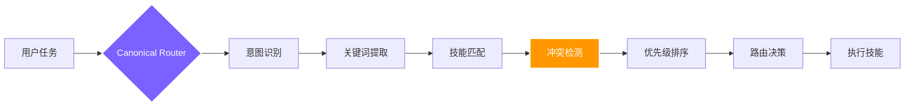

<div align="right">
  <a href="./README.md">🇬🇧 English</a> &nbsp;|&nbsp; <b>🇨🇳 中文</b>
</div>

<br/>

<div align="center">

<a href="https://github.com/foryourhealth111-pixel/Vibe-Skills">
  
</a>

<br/>


<br/><br/>

### 不只是技能集合，更是你的**个人 AI 操作系统**

能用 Skills 的地方，就能用 VibeSkills——340+ 技能覆盖编程、科研、数据与创作

<br/>

<a href="https://github.com/foryourhealth111-pixel/Vibe-Skills/stargazers">
  
</a>
<a href="https://github.com/foryourhealth111-pixel/Vibe-Skills/network/members">
  
</a>
<a href="https://github.com/foryourhealth111-pixel/Vibe-Skills/pulse">
  
</a>
<a href="https://gitcgr.com/foryourhealth111-pixel/Vibe-Skills">
  
</a>

<br/><br/>


&nbsp;

&nbsp;


<br/><br/>

🧠 规划 · 🛠️ 工程 · 🤖 AI · 🔬 科研 · 🎨 创作

<br/>

<a href="https://github.com/foryourhealth111-pixel/Vibe-Skills/blob/main/docs/install/one-click-install-release-copy.md">
  
</a>
&nbsp;
<a href="https://github.com/foryourhealth111-pixel/Vibe-Skills/blob/main/docs/quick-start.md">
  
</a>
&nbsp;
<a href="./README.md">
  
</a>

<br/><br/>

<kbd>安装</kbd> &nbsp;→&nbsp;
<kbd>vibe | vibe-want | vibe-how | vibe-do</kbd> &nbsp;→&nbsp;
<kbd>智能路由</kbd> &nbsp;→&nbsp;
<kbd>M / L / XL 执行</kbd> &nbsp;→&nbsp;
<kbd>治理验证</kbd> &nbsp;→&nbsp;
<kbd>✅ 交付</kbd>

</div>

## 📋 目录

- [为什么与众不同](#-为什么它与众不同)
- [适合你吗](#-适用人群)
- [智能路由](#-智能路由机制340-技能如何协同而不冲突)
- [记忆机制](#-记忆机制让-ai-真正记住你的一切)
- [全景能力地图](#-全景能力地图你的全能工作台)
- [安装与管理](#️-安装与-skills-管理)
- [开始使用](#-开启你的-vibe-体验)


<details>
<summary><b>🔑 初次使用？点击展开关键概念说明</b></summary>

<br/>

| 术语 | 通俗解释 |
|:---|:---|
| **VibeSkills / VCO** | 即本项目。VCO = Vibe Code Orchestrator，是驱动所有技能运行的核心引擎。 |
| **技能（Skill）** | 独立的能力模块，例如 `tdd-guide`（测试驱动）、`code-review`（代码审查）。可理解为系统按需调用的专家助手。 |
| **受管运行时（Governed runtime）** | 调用 `vibe` 后，系统会遵循「澄清 → 规划 → 执行 → 验证」的完整流程，而不是盲目直接执行。当前公开的可发现 wrapper 集合固定为 `vibe`、`vibe-want`、`vibe-how`、`vibe-do`；宿主可以把它们显示成 `Vibe: What Do I Want?`、`Vibe: Do It` 这类标签，但它们仍然回到同一个 canonical runtime authority。 |
| **权威路由器（Canonical Router）** | 根据你的任务自动决定调用哪个技能的内部逻辑，无需手动干预，直接调用 `/vibe` 即可。 |
| **M / L / XL 执行级别** | 任务复杂度等级：M = 快速小任务，L = 多步骤任务，XL = 可并行的大型任务。系统自动选择。公开覆盖只保留 `--l` 和 `--xl`，它们是执行偏好，不是新的入口。 |
| **冻结需求（Frozen requirement）** | 确认计划后，系统将锁定需求范围，不会在执行过程中偷偷改变方向。 |
| **根/子通道（Root/Child lane）** | XL 任务中的协调者（根）与执行者（子）角色划分，防止多代理执行时产生输出冲突。 |
| **证明材料（Proof bundle）** | 任务真正完成的证据——测试结果、输出内容、验证日志等。 |

</details>

> [!IMPORTANT]
> ### 🎯 核心愿景
>
> Vibe Skills 将与时俱进——保证好用、持续提升效率，同时**大幅降低前沿 vibecoding 技术的学习门槛**，消解面对新技术的认知焦虑。
>
> **无论你是否具备编程基础，都能以极低门槛直接调用当今最前沿的 AI 技术集合。**
> 让每个人都能享受 AI 带来的生产力飞跃。

<br/>

---


## ✨ 为什么它与众不同？

> 传统的 Skills 仓库在回答：_"我这里有什么工具？"_
> **VibeSkills 正面迎击的是重度 AI 用户的核心痛点：_"我该怎么管理调用大量 Skills，并且高效稳定地完成工作？"_**

<sub>适用于 **Claude Code** · **Codex** · **Windsurf** · **OpenClaw** · **OpenCode** · **Cursor** 及所有支持 Skills 协议的 AI 环境，原生兼容 **MCP**。</sub>

<br/>

<div align="center">

| ❌ &nbsp;传统痛点（你可能经历过）| ✅ &nbsp;VibeSkills 解法（我们正在做）|
|:---|:---|
| **技能沉睡**：仓库里几百个能力，真实场景下 AI 根本想不起来用，激活率极低。| **🧠 智能路由**：该调什么，系统根据上下文自动路由拉起，无需你翻背技能表。|
| **黑盒狂奔**：AI 不澄清需求就直接开做，速度快但方向偏，项目逐渐变成黑盒。| **🧭 受管工作流**：澄清 → 验证 → 留痕被严格收进统一流程，每步可溯源。|
| **互相冲突**：不同插件和工作流之间缺乏统筹，导致环境污染或死循环。| **🧩 全局治理**：129 条契约规则设定安全边界与回退机制，保障长期稳定性。|
| **工作区脏乱差**：工作久了仓库混乱，新 Agent 接手时遗漏项目细节，衔接断层。| **📁 文件目录语义治理**：固定化架构存储文件，让新对话的 AI 立刻理解上下文。|
| **AI 小毛病频发**：删备份时把主文件删了；写了一堆静默兜底，自信满满说"做好了"。| **🛡️ 内置防护规则**：受管执行默认拦截危险批量删除与盲目递归清空；兜底行为必须显式警告用户。|
| **用户自行规范工作流**：需要靠经验手动维护与 AI 的协作流程，学习成本高。| **🚦 框架引导全程**：需求沟通 → 计划确认 → 多代理并发执行 → 自动测试迭代，全程托管。|
| **多代理并发时技能分发混乱**：处理多种任务时，不好指定分发对应技能。| **🤖 自动技能分发**：多代理工作流自动为每个 Agent 分配任务对应的 Skills。|

</div>

<br/>

---


## 👥 适用人群

_这些痛点，你中了几条？找准自己的位置，接下来的系统设计才真正有意义。_

<details>
<summary>适合你吗？点击展开</summary>

<br/>

<div align="center">

| 人群 | 描述 |
|:---:|:---|
| 🎯 **追求稳定交付的普通用户** | 想让 AI 成为可靠的帮手，而不是脱缰的野马 |
| ⚡ **重度依赖 AI/Agent 的进阶极客** | 需要一个能承载庞大工作流的统一底座 |
| 🏢 **规范化要求高的小型团队** | 希望把 AI 工作流变得更具可维护性和传承性 |
| 😩 **被"技能堆砌"折磨的实践者** | 已厌倦找工具，只想要一套开箱即用的解决方案 |

</div>

> _如果你只想找个单一的小脚本，它可能过于庞大；但如果你想把 AI 用得更稳、更顺、更长远，它将是你不可或缺的利器。_

</details>

<br/>

---


## 🔀 智能路由机制：340+ 技能如何协同而不冲突

_确认了这是给你的之后，下一个问题：340+ 技能并存，系统怎么不乱？_

面对 340+ 技能，你可能会担心：_"这么多相似的技能，会不会互相打架？系统怎么知道该用哪个？"_

### 路由如何工作

VibeSkills 使用 **Canonical Router（权威路由器）** 作为唯一的路由决策中心：



VibeSkills 遵循 `澄清 ➔ 规划 ➔ 执行 ➔ 验证` 的受管工作流，确保每个任务都经过完整的质量把控：

- **需求澄清**：通过 `speckit-clarify` 等技能明确边界和验收标准
- **架构规划**：使用 `aios-architect` 等技能设计实现路径
- **执行层**：340+ 技能按需调用，完成具体工作
- **质量验证**：通过 `tdd-guide`、`code-review` 等技能确保交付质量

---

### 为什么这样设计？

传统 Skills 仓库让 AI"自由选择"，结果是：

- ❌ AI 记不住有哪些技能
- ❌ 相似技能彼此冲突
- ❌ 执行路径不可预测

VibeSkills 的路由保证：

- ✅ **确定性**：相同任务始终遵循相同的路由逻辑
- ✅ **可追溯性**：每次路由决策都有清晰理由
- ✅ **可控性**：用户可以通过显式调用覆盖默认路由（例如 `/vibe`）
- ✅ **稳定性**：129 条治理规则防止冲突和分叉

---

### M / L / XL 执行级别

路由器在选择主技能后，还会根据任务复杂度自动判断执行级别：

<div align="center">

| 级别 | 适用场景 | 特点 |
|:---:|:---|:---|
| **M** | 窄范围执行，边界清楚的小范围工作 | 单代理，省 token，响应快 |
| **L** | 中等复杂任务，需要设计、计划与评审 | 按计划步骤进行原生串行执行；仅在显式规划时启用有界委派单元 |
| **XL** | 大任务，可并行、长流程、多代理分波推进 | 分波顺序推进，仅对独立单元启用步骤级有界并行 |

</div>

> 系统会在需求澄清之后、计划执行之前，自动选择级别。当前公开投影出来的宿主入口固定为 `vibe`、`vibe-want`、`vibe-how`、`vibe-do`；支持菜单化展示的宿主可以把它们渲染成 `Vibe`、`Vibe: What Do I Want?`、`Vibe: How Do We Do It?`、`Vibe: Do It`，但底层仍然只进入同一个 governed runtime。
>
> 当系统内部调用专项技能（如 `tdd-guide`、`code-review`）时，这些技能始终被限定在特定执行阶段，只起辅助作用，不会抢占整体流程的控制权。在 XL 级别的多代理任务中，子代理可以建议使用某个专项技能，但需由协调者（根代理）批准后才会实际执行。
>
> 你也可以显式表达偏好：
> ```text
> 我希望你按照计划执行这个任务，启动 XL 级工作流 /vibe
> ```

> 公开允许的轻量级别覆盖只有 `--l` 和 `--xl`。像 `vibe-l`、`vibe-xl`、`vibe-how-xl` 这样的组合别名是故意不支持的。

---

<details>
<summary><b>🔍 路由机制详解与常见问题（点击展开）</b></summary>

<br/>

**一次路由一个还是多个？**

核心原则：一次任务通常路由到一个主技能，但该技能可以调用其他技能作为子流程。

- **单一主路由**：Canonical Router 会选择**一个最匹配的主技能**
- **技能组合**：主技能在执行过程中，可按需调用其他技能（如 `vibe` 可调用 `speckit-clarify`、`aios-architect` 等）
- **受管协同**：多个技能的协同由治理规则控制，而不是随意组合

<br/>

**相似技能的冲突如何处理？**

当多个技能看起来都能完成任务时，路由器通过以下机制避免冲突：

1. **优先级规则**：每个技能都有明确的优先级和适用场景
2. **上下文匹配**：分析任务复杂度、是否需要多阶段、用户显式偏好
3. **互斥规则**：129 条规则中包含互斥规则，防止冲突组合
4. **降级和回退**：首选技能不可用时按优先级尝试备选，不会陷入死循环

<br/>

**会因为选项过多导致 token 爆炸吗？**

不会。路由不是把所有选项抛给模型，而是采用智能触发机制：

```
用户命令 → AI 辅助治理发掘意图关键词 → 关键词触发技能路由
```

治理框架下有约 30k 的初始上下文消耗，但不会导致 token 爆炸。

<br/>

**实际例子：用户说"帮我重构这个项目"**

1. 意图识别 → 复杂重构任务
2. 关键词提取 → 重构、项目、代码质量
3. 技能匹配 → `vibe` / `autonomous-builder` / `systematic-debugging`
4. 路由决策 → 选择 `vibe`（重构需要多阶段：需求澄清 → 计划制定 → 分阶段执行 → 验证测试）

</details>

<br/>

---

<details>
<summary><b>🔧 路由兼容性注释（点击展开）</b></summary>

<br/>

- `M=single-agent`（单代理执行）
- `L`：按计划逐步串行执行，包含设计 → 规划 → 用户确认 → 执行 → 双阶段审查
- XL 原生编排 API：`spawn_agent`/`send_input`/`wait`/`close_agent`（内部调用接口，无需用户操作）

</details>

<br/>

---


## 🧠 记忆机制：让 AI 真正"记住"你的一切

_路由解决了「用哪个技能」。但有一个更根本的问题：对话结束后，AI 记得你吗？_

你是否遇到过这些情况？

<div align="center">

| ❌ 痛点场景 | ✅ VibeSkills 的解法 | 负责组件 |
|:---|:---|:---:|
| 每次新对话都要从头解释项目背景 | 架构决策、技术规范永久归档，新会话自动载入 | `Serena` |
| AI 踩过的坑下次还会踩，灵感随上下文消失 | 一句话存入 Obsidian + GitHub，知识永久沉淀 | `knowledge-steward` |
| 长任务中 AI 逐渐"忘记"早期上下文 | 会话内语义向量缓存，毫秒级找回相关片段 | `ruflo` |
| 跨项目知识无法积累复用 | 实体关系图谱跨会话积累，越用越聪明 | `Cognee` |
| 长任务中断后难以衔接给新 Agent | 自动折叠为工作记忆 + 工具记忆 + 证据锚点 | `deepagent-memory-fold` |

</div>

<br/>

<details>
<summary><b>📐 展开：四层记忆架构详解、技能说明与治理规则</b></summary>

<br/>

VibeSkills 构建了**四层记忆体系**，每种记忆需求有且只有一个负责组件：

| 层级 | 组件 | 作用域 | 核心用途 |
|:---:|:---:|:---:|:---|
| **L1 会话层** | `state_store` | 当前会话 | 执行进度、中间结果、临时状态——永远在线的"工作台" |
| **L2 项目层** | `Serena` | 当前项目 | 架构决策、技术规范、项目约定——只写入经用户明确确认的决策 |
| **L3 短期语义层** | `ruflo` | 会话内语义检索 | 向量缓存，让 Agent 在单次长任务中快速找回相关上下文片段 |
| **L4 长期图谱层** | `Cognee` | 跨会话 | 实体关联、关系图谱、长周期知识积累——AI 的"长期记忆" |

> **可选外部扩展**：`mem0` 可作为个人偏好后端（输出风格、重复约束），以 opt-in 方式软接入；`Letta` 提供记忆块映射与 Token 压力策略——两者均不替代上述四层的权威地位。

<br/>

**三个专属记忆技能**

| 技能 | 定位 | 触发方式 |
|:---:|:---|:---|
| `knowledge-steward` | **知识管家**：一句话把对话中的灵感、踩坑、有效 Prompt 永久存入 Obsidian + GitHub | "保存这个提示词" / "记录这个 Bug" / "save this insight" |
| `digital-brain` | **数字大脑**：结构化个人知识库，管理身份定位、内容创作、人脉网络、项目复盘 | 主动调用，适合建立个人知识操作系统 |
| `deepagent-memory-fold` | **上下文折叠**：长任务运行中自动将庞大上下文压缩为结构化的工作 + 工具 + 证据记忆 | 长任务 context 临近上限时自动或手动触发 |

<br/>

**治理规则**：单一权威源（无双轨竞争）· 显式写入（`Serena` 仅用户确认后写入）· `episodic-memory` 永久禁用 · `mem0` 只记录个人偏好（禁止路由决策/项目真相）· 任何外部后端均有 Kill Switch 一键降级

</details>

### 工作区共享记忆升级后，实际会发生什么

这次升级把记忆连续性改成了“按工作区共享”的默认行为，实际效果可以直接理解为：

- **同一工作区，不同会话/不同代理可共享**：`codex`、`claude-code` 等宿主，只要落在同一个工作区里，就能命中同一套项目记忆。
- **不同工作区，严格隔离不串味**：即使两个工作区共用同一个 backend root，记忆也会按工作区身份隔离，不会跨仓库泄漏。
- **只回忆相关内容**：检索前会先剔除 `$vibe`、`plan`、`continuity` 这类通用脚手架词，真正决定命中的，是当前任务里的业务词和过去记忆里的业务词是否对上。
- **渐进式披露，不会把历史全塞进上下文**：需求阶段、规划阶段只拿到少量 capsule 摘要；只有到执行阶段，才会在预算内看到更丰富的证据包。
- **broker 挂了就显式失败，不偷偷降级**：如果工作区 broker 不可用，运行时会直接报错，而不是静默退回 legacy 的 lane-local 存储路径。

可以把它理解成下面这 4 步：

1. 运行时先把决策、handoff 卡片、关系等内容存成小而结构化的记忆记录。
2. 后续任务只在当前工作区里检索，并按业务相关词打分排序。
3. 系统只挑少量有边界的记忆 capsule 注入到下一阶段。
4. 阶段越靠后，可披露的信息可以更多，但永远不会把整份记忆库一股脑塞进提示词。

技术契约见 [工作区记忆平面设计](./docs/design/workspace-memory-plane.md)，量化验证见 [Codex 记忆仿真测试](./tests/runtime_neutral/test_codex_memory_user_simulation.py)。


---


## ✦ 全景能力地图：你的全能工作台

_这一节不是完整的 skill 名字清单，而是帮助你快速判断：VibeSkills 大致能覆盖哪些工作。_

_如果你只是想先判断它适不适合你的任务，看下面这张表就够了。_

<br/>

<div align="center">

| 工作方向 | 它主要能帮你做什么 | 代表能力 |
|:---|:---|:---|
| **💡 需求、规划与产品工作** | 把模糊想法讲清楚，写成 spec、计划和可执行任务 | `brainstorming`, `writing-plans`, `speckit-specify` |
| **🏗️ 工程开发、架构与受管执行** | 设计系统边界、落地代码改动，并协调多步骤工作流 | `aios-architect`, `autonomous-builder`, `vibe` |
| **🔧 调试、测试与质量控制** | 排查问题、补测试、做 review，并在完成前做核验 | `systematic-debugging`, `verification-before-completion`, `code-review` |
| **📊 数据分析与统计建模** | 清洗数据、做统计分析、探索模式并解释结果 | `statistical-analysis`, `performing-regression-analysis`, `data-exploration-visualization` |
| **🤖 机器学习与 AI 工程** | 训练、评估、解释并迭代模型相关工作流 | `senior-ml-engineer`, `training-machine-learning-models`, `evaluating-machine-learning-models` |
| **🔬 科研、文献与生命科学** | 做文献检索、科研支持，以及偏生信和生命科学的任务 | `literature-review`, `research-lookup`, `scanpy` |
| **📐 科学计算与数学建模** | 处理符号推导、概率建模、仿真和优化问题 | `sympy`, `pymc-bayesian-modeling`, `pymoo` |
| **🎨 文档、可视化与交付输出** | 把结果整理成文档、图表、图像、幻灯片等可交付内容 | `docs-write`, `plotly`, `scientific-visualization` |
| **🔌 外部集成、自动化与交付** | 连接浏览器、网页、外部服务、CI/CD 和部署流程 | `playwright`, `scrapling`, `aios-devops` |

</div>

<br/>

<details>
<summary><b>👉 按需展开：查看更细的能力分类、适用场景与分工</b></summary>

<br/>

这一部分讲的是完整覆盖面，但会尽量说人话。
它主要回答三个实际问题：

1. 你在什么场景下会用到这一类能力？
2. 为什么会同时保留几个看起来相近的 skill？
3. 这一类里，哪些是比较典型的代表项？

下面列的是代表项，不是把所有 skill 名字一股脑堆出来。重点是把角色和分工讲清楚，而不是把 README 写成库存表。

---

### 🧠 需求、规划与产品管理

**什么时候会用到**：当任务还很模糊，第一步不是写代码，而是先搞清楚“到底要解决什么问题”。

**为什么会共存**：它们解决的是同一条链路上的不同环节。一个负责澄清需求，一个负责写 spec，一个负责把 spec 拆成计划，还有的继续往下拆成任务。

**通常怎么遇到**：项目刚开始时、需求还没冻结时，或者要做高风险改动前。

**代表项**：`brainstorming`, `speckit-clarify`, `writing-plans`, `speckit-specify`

---

### 🛠️ 软件工程与架构设计

**什么时候会用到**：当问题已经比较清楚，开始进入“怎么设计、怎么实现、怎么协调落地”这一步。

**为什么会共存**：有的偏架构和边界设计，有的偏具体开发落地，有的偏多步骤、多代理的受管执行。它们很近，但不是一回事。

**通常怎么遇到**：规划完成后，任务开始涉及多文件修改、多层结构或多阶段执行时。

**代表项**：`aios-architect`, `architecture-patterns`, `autonomous-builder`, `vibe`

---

### 🔧 调试、测试与质量保证

**什么时候会用到**：当东西坏了、风险高、需要补测试，或者准备提交 review 的时候。

**为什么会共存**：排错、写测试、做 review、做完成前核验，本来就是不同动作。一个偏快速修复入口，另一个偏严格排障流程，谁都不能完全替代谁。

**通常怎么遇到**：报错之后、PR 之前，或者改动完成后需要拿证据说话的时候。

**代表项**：`systematic-debugging`, `error-resolver`, `verification-before-completion`, `code-review`

---

### 📊 数据分析与统计建模

**什么时候会用到**：当重点是“看数据、清数据、解释数据”，而不是先上模型。

**为什么会共存**：有的负责清洗和探索，有的负责统计检验，有的负责可视化，有的适合特定数据类型或处理链路。它们是配合关系，不是重复关系。

**通常怎么遇到**：建模前、实验分析时，或者当你真正想问“这些数据到底说明了什么”。

**代表项**：`statistical-analysis`, `performing-regression-analysis`, `detecting-data-anomalies`, `data-exploration-visualization`

---

### 🤖 机器学习与 AI 工程

**什么时候会用到**：当任务目标已经从“理解数据”变成“训练、评估、解释和迭代模型”。

**为什么会共存**：训练、评估、可解释性、实验记录本来就不是同一个动作。模型训练 skill 不等于数据分析 skill，可解释性 skill 也不该替代训练链路。

**通常怎么遇到**：数据准备完成后，需要真正跑模型、比较结果，或者理解模型为什么这样输出时。

**代表项**：`senior-ml-engineer`, `training-machine-learning-models`, `evaluating-machine-learning-models`, `explaining-machine-learning-models`

---

### 🧬 科研、文献与生命科学

**什么时候会用到**：当任务本身是科研工作，尤其是文献整理、研究支持、生命科学或生信分析。

**为什么会共存**：科研流程天然就是多步的。有人负责找论文，有人负责整理证据，有人负责分析实验数据，也有人负责生命科学专用工具链。

**通常怎么遇到**：做文献综述、单细胞分析、基因组学任务，或药物和实验支持类工作时。

**代表项**：`literature-review`, `research-lookup`, `biopython`, `scanpy`

---

### 🔬 科学计算与数学逻辑

**什么时候会用到**：当问题真正难的地方在数学推导、形式化建模、仿真或优化上。

**为什么会共存**：有的偏符号推导，有的偏概率模型，有的偏仿真，有的偏优化或形式逻辑。它们都跟“算”有关，但处理的不是同一种问题。

**通常怎么遇到**：科研任务、量化建模，或者自然语言解释已经不够精确的场景里。

**代表项**：`sympy`, `pymc-bayesian-modeling`, `pymoo`, `qiskit`

---

### 🔌 外部集成、自动化与部署

**什么时候会用到**：当任务离不开浏览器、网页内容、设计平台、外部服务、CI 或部署环境。

**为什么会共存**：浏览器交互、页面抓取、外部服务适配、部署自动化虽然都属于“连接外部世界”，但解决的是不同层面的工作。比如 `playwright` 和 `scrapling` 都碰网页，但一个更适合浏览器行为，一个更适合抓取和提取内容。

**通常怎么遇到**：当任务已经不能只靠模型本身完成，而是必须去碰外部系统的时候。

**代表项**：`playwright`, `scrapling`, `mcp-integration`, `aios-devops`

---

### 🎨 文档、可视化与交付输出

**什么时候会用到**：当任务结果需要被别人阅读、展示、评审或交付出去的时候。

**为什么会共存**：图表、文档、幻灯片、图片虽然都属于输出层，但服务的格式和对象不同。它们被放在一类，是因为都承担“把结果变成可交付物”的职责，而不是因为可以互相替代。

**通常怎么遇到**：工作流后段，当分析结果、研究结论或工程产出需要变成报告、图示、幻灯片或更完整的文档时。

**代表项**：`docs-write`, `plotly`, `scientific-visualization`, `generate-image`

---

合起来看，这些类别覆盖的是不同任务类型、不同工作阶段和不同交付形式。相似 skill 同时存在，通常不是为了重复堆料，而是因为它们分别承担了阶段差异、领域差异、宿主适配，或输出格式差异带来的不同职责。

</details>

<br/>

---


## 📊 为什么说它强大？

_看完完整版图，来看实际数字。这不是演示项目，而是已经跑起来的系统：_

**VibeSkills** 背后的运行时核心是 **VCO**。它绝不仅仅是一个单点工具或只会"补代码"的脚本，而是一个已完成高度整合与治理的**超级能力网络**：

<br/>

<div align="center">

|                              🧩 技能模块                               |                            🌍 生态融合                            |                               ⚖️ 治理规则                                |
| :---------------------------------------------------------------------: | :---------------------------------------------------------------: | :----------------------------------------------------------------------: |
| <h2>340+</h2>可直接调用的 Skills<br/>覆盖从需求规划到执行的完整链路 | <h2>19+</h2>吸收高价值上游开源项目<br/>与最佳实践来源 | <h2>129 条</h2>基于配置的策略与契约<br/>确保执行稳定、可溯源、防发散 |

</div>

<br/>

---


## ⚙️ 安装与 Skills 管理

你不需要先把整套架构弄懂，才能把 VibeSkills 装起来。

### 默认怎么装

1. 先确认你准备在哪个客户端里用它：`codex`、`claude-code`、`cursor`、`windsurf`、`openclaw`、`opencode`
2. 第一次安装、又没有特别要求时，直接选 `安装 + full`
3. 打开主安装页：
   [提示词安装（推荐）](https://github.com/foryourhealth111-pixel/Vibe-Skills/blob/main/docs/install/one-click-install-release-copy.md)
4. 找到对应客户端和版本，复制提示词，并粘贴到对应 AI 里执行
5. 安装完成后，按下面的 [开启你的 Vibe 体验](#-开启你的-vibe-体验) 调用方式开始使用

### `full` 还是 `minimal`？

- 想按推荐方式直接装好并开始用，就选 `full`
- 只有你明确只想要更小、更轻的框架安装时，再选 `minimal`

### 什么时候再看其他安装文档？

- 不知道自己该选哪种宿主路径：看 [冷启动宿主矩阵](https://github.com/foryourhealth111-pixel/Vibe-Skills/blob/main/docs/cold-start-install-paths.md)
- 想看更完整的分步命令：看 [多宿主命令参考](https://github.com/foryourhealth111-pixel/Vibe-Skills/blob/main/docs/install/recommended-full-path.md)
- 需要 OpenClaw / OpenCode 的宿主补充说明：看 [OpenClaw 宿主说明](https://github.com/foryourhealth111-pixel/Vibe-Skills/blob/main/docs/install/openclaw-path.md) 或 [OpenCode 宿主说明](https://github.com/foryourhealth111-pixel/Vibe-Skills/blob/main/docs/install/opencode-path.md)
- 需要离线或手动复制安装：看 [手动复制安装](https://github.com/foryourhealth111-pixel/Vibe-Skills/blob/main/docs/install/manual-copy-install.md)

<details>
<summary><b>🔧 高级安装细节</b></summary>

下面这些内容只在你需要手动补配置、排查问题或做高级定制时再看。

**如果文档要求你手动补一步，这些是真实文件路径**

- Codex：`~/.codex/settings.json`
- Claude Code：`~/.claude/settings.json`
- Cursor：`~/.cursor/settings.json`
- OpenCode：`~/.config/opencode/opencode.json`
- Windsurf / OpenClaw sidecar：`<target-root>/.vibeskills/host-settings.json`

**安装后对外保留什么**

- 对外运行时入口：`<target-root>/skills/vibe`
- 内部 bundled 语料：`<target-root>/skills/vibe/bundled/skills/*`
- 兼容性辅助文件：只有宿主明确需要时才生成

`.vibeskills` 被拆成两层：

- host-sidecar：`<target-root>/.vibeskills/host-settings.json`、`host-closure.json`、`install-ledger.json`、`bin/*`
- workspace-sidecar：`<workspace-root>/.vibeskills/project.json`、`.vibeskills/docs/requirements/*`、`.vibeskills/docs/plans/*`、`.vibeskills/outputs/runtime/vibe-sessions/*`

**哪些宿主已经做过安装后验证**

| 宿主 | 已验证的范围 |
|:---|:---|
| `codex` | planning、debug、governed execution、memory continuity |
| `claude-code` | planning、debug、governed execution、memory continuity |
| `openclaw` | planning、debug、governed execution、memory continuity |
| `opencode` | planning、debug、governed execution、memory continuity |

这些检查说明：安装后的 `vibe` 仍然能负责路由、写出治理和清理记录，并保持记忆连续性；但这不等于“每一种宿主调用语法都被同一次验证直接跑过”。

**卸载和自定义**

- 卸载入口：`uninstall.ps1 -HostId <host>`、`uninstall.sh --host <host>`
- 卸载治理说明：[`docs/uninstall-governance.md`](https://github.com/foryourhealth111-pixel/Vibe-Skills/blob/main/docs/uninstall-governance.md)
- 自定义 Skill 接入：[自定义工作流与 Skill 接入指南](https://github.com/foryourhealth111-pixel/Vibe-Skills/blob/main/docs/install/custom-workflow-onboarding.md)

</details>

## 📦 集众家之所长：资源整合

_这些能力不是闭门造车做出来的。VibeSkills 会参考现有开源项目、方法和工具，再把适合的部分接入同一套受管运行时。_

VibeSkills 并不声称要替代、也不会完整复刻下面列出的每一个上游项目。更实际的目标是：在合适的地方复用已经被验证的方法和能力，再通过同一套运行时与治理层把它们串起来，减少日常使用时的切换和拼装成本。

> 🙏 **鸣谢**
>
> 本项目参考、适配或接入了以下项目中的部分思路、工作流或工具能力：
>
> `superpower` · `claude-scientific-skills` · `get-shit-done` · `aios-core` · `OpenSpec` · `ralph-claude-code` · `SuperClaude_Framework` · `spec-kit` · `Agent-S` · `mem0` · `scrapling` · `claude-flow` · `serena` · `everything-claude-code` · `DeepAgent` 等等
>
> _我们会尽量认真处理上游来源的署名与说明。如果有遗漏，或某处表述不准确，欢迎在 Issue 中指出，我们会及时修正。_

<br/>

---


## 🚀 开启你的 Vibe 体验

_如果你已经装好了 VibeSkills，接下来只需要一次调用。_

> ⚠️ **调用说明**：VibeSkills 采用 **Skills 格式运行时**，请从宿主环境的 Skills 入口调用，**不要**把它当成独立 CLI 程序直接运行。

<br/>

<div align="center">

| 宿主环境 | 调用方式 | 示例 |
|:---:|:---:|:---|
| **Claude Code** | `/vibe` | `请帮我规划这个任务 /vibe` |
| **Codex** | `$vibe` | `请帮我规划这个任务 $vibe` |
| **OpenCode** | `/vibe` | `请用 vibe 帮我规划这次改动。` |
| **OpenClaw** | Skills 入口 | 参考宿主说明 |
| **Cursor / Windsurf** | Skills 入口 | 参考各平台 Skills 调用文档 |

</div>

<br/>

- 第一次可以先从一个很小的请求开始，比如让它先帮你澄清、规划或拆分任务。
- 如果你希望后续每一轮都留在受管工作流里，就在每条消息后面继续附上 `$vibe` 或 `/vibe`。
- 如果你还没安装，先回到 [提示词安装（默认推荐）](https://github.com/foryourhealth111-pixel/Vibe-Skills/blob/main/docs/install/one-click-install-release-copy.md)。

> MCP 说明：`$vibe` 或 `/vibe` 只表示进入 governed runtime，**不等于 MCP 完成**，也不能单独证明某个 MCP 已安装到宿主原生 MCP 配置面。

**当前宿主状态**：`codex` 和 `claude-code` 是目前最清晰、最完整的安装与使用路径。`cursor`、`windsurf`、`openclaw`、`opencode` 也可用，但其中一部分仍偏 preview 或带宿主特定约束。

<br/>

---

<details>
<summary><b>📚 文档导航与安装指引（点击展开）</b></summary>

<br/>

**先看这两个**

- ⚡️ [提示词安装（默认推荐）](https://github.com/foryourhealth111-pixel/Vibe-Skills/blob/main/docs/install/one-click-install-release-copy.md)
- 📖 [了解系统架构与理念](https://github.com/foryourhealth111-pixel/Vibe-Skills/blob/main/docs/quick-start.md)

**下面这些按需再看**

- 🧩 [自定义工作流接入](https://github.com/foryourhealth111-pixel/Vibe-Skills/blob/main/docs/install/custom-workflow-onboarding.md)
- 📄 [OpenClaw 宿主说明](https://github.com/foryourhealth111-pixel/Vibe-Skills/blob/main/docs/install/openclaw-path.md)
- 📄 [OpenCode 宿主说明](https://github.com/foryourhealth111-pixel/Vibe-Skills/blob/main/docs/install/opencode-path.md)
- 📁 [手动复制安装（离线）](https://github.com/foryourhealth111-pixel/Vibe-Skills/blob/main/docs/install/manual-copy-install.md)
- 🛠 [高级 host / lane 参考](https://github.com/foryourhealth111-pixel/Vibe-Skills/blob/main/docs/install/recommended-full-path.md)
- 🧊 [冷启动与其他环境说明](https://github.com/foryourhealth111-pixel/Vibe-Skills/blob/main/docs/cold-start-install-paths.md)

</details>

<br/>

<div align="center">

### 🤝 加入社区 · 共建生态

欢迎来尝试和体验！有问题、有想法、有建议，欢迎随时提出——鄙人不才，一定认真听取和修改。

<br/>

**本项目完全开源，欢迎一切形式的贡献！**

无论是修复 bug、提升性能、添加新功能还是完善文档，你的每一个 PR 都弥足珍贵。

```
Fork → 修改 → Pull Request → 合并 ✅
```

<br/>

> ⭐ 如果这个项目对你有帮助，点个 **Star** 是对我最大的支持！
> 您的支持也是我这个核动力驴的浓缩 U-235 :blush:

<br/>

感谢 **LinuxDo** 各位佬的支持！

[](https://linux.do/)

各种技术交流、AI 前沿资讯、AI 经验分享，尽在 Linuxdo！

</div>

<br/>

---


## Star History

<a href="https://www.star-history.com/?repos=foryourhealth111-pixel%2FVibe-Skills&type=date&legend=top-left">
  <picture>
    <source media="(prefers-color-scheme: dark)" srcset="https://api.star-history.com/image?repos=foryourhealth111-pixel/Vibe-Skills&type=date&theme=dark&legend=top-left" />
    <source media="(prefers-color-scheme: light)" srcset="https://api.star-history.com/image?repos=foryourhealth111-pixel/Vibe-Skills&type=date&legend=top-left" />
    
  </picture>
</a>

<br/>

---

<div align="center">
  <p><i>把真实工作里最容易失控的部分，变成一个更可调用、更可治理、也更可长期维护的系统。</i></p>
  <br/>
  <sub>Made with ❤️ &nbsp;·&nbsp; <a href="https://github.com/foryourhealth111-pixel/Vibe-Skills">GitHub</a> &nbsp;·&nbsp; <a href="./README.md">English</a></sub>
</div>
